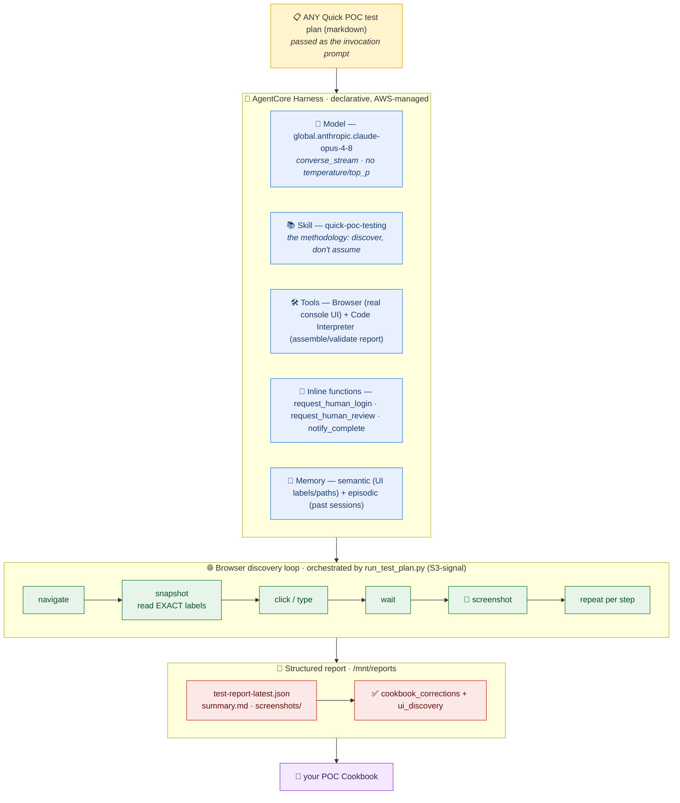

# Amazon Quick POC Best-Practices Agent (built on AgentCore Harness)

A **general-purpose web-UI agent** that executes **any** Amazon Quick / QuickSight POC test plan like a human QA
engineer — logging into the console, clicking, typing, configuring — and captures the **actual UI state** (button
labels, menu paths, URLs, field names, dialogs, timings) so you can verify and correct your POC **Cookbook** against
real Console behavior.

Amazon Quick has **no public API** for these console features, so a human normally has to click through every POC. This
agent replaces that human effort.

## The chef principle

> Give the chef any recipe and they cook the dish. Give this agent any Quick POC **test plan** and it performs the
> configuration and testing.

The agent is **not** hardcoded to one scenario. The reusable "cooking technique" lives in the **`quick-poc-testing`
skill** (a discovery-first methodology); the **test plan is the recipe** passed in at invocation time. Today's recipe
is `test-plan/E2E-Sales-Dashboard-App.md` (REST connector → Quick App built by AI → preview → publish/share), but the
same agent runs a plan about data sources, analyses, spaces, chat agents, integrations, automations, embedding, or
permissions without any code change.

The point is **UI discovery, not pass/fail**: when the Cookbook says "click *Create connector*" but the real flow is to
pick a **"REST API connection"** card, that discrepancy is captured in `cookbook_corrections` so you can fix the
Cookbook.

## Validated end-to-end ✅

This agent was run end-to-end against **real Amazon Quick Suite** (a temporary IAM Identity Center / SSO-gated workshop
account) executing `test-plan/E2E-Sales-Dashboard-App.md`. The full evidence is committed under `reports/`.

| Metric | Result |
|---|---|
| Overall status | **PARTIAL** |
| Steps | 21 total — **12 PASS** · 6 PARTIAL · **1 FAIL** · 2 SKIP |
| Cookbook corrections captured | **11** |
| Screenshots captured | **21** (`reports/screenshots/`) |

The single FAIL is **sharing a Quick App with an external email address**: the "Share this app" search
(placeholder *"Search for name, alias or email"*) returns **"No results found"** for a non-directory email and the
**Share button stays disabled** — only existing directory users, "Share with all", or "Copy link" work. That is a real
product behavior, captured as a cookbook correction rather than an agent defect.

Read `reports/summary.md` for the human-readable headline findings and `reports/test-report-latest.json` for the
full structured report (`cookbook_corrections[]` + `ui_discovery{}` are the payload you feed back into your Cookbook).

## Architecture



The **orchestrator** (`harness/run_test_plan.py`) is a thin human-in-the-loop driver around `InvokeHarness`. Its
`live` subcommand runs the plan in a single uninterrupted turn while a human completes the SSO login out-of-band; the
agent **polls an S3 flag** for a login-done signal instead of pausing the turn (see below). The `start`/`resume`
subcommands implement the alternative inline-function pause/resume contract, and `signal` writes the S3 flag.

## Human-assisted SSO login procedure (confirmed working)

The console is behind Enterprise IAM Identity Center SSO + MFA, and the agent never types credentials. The flow that
**works reliably** is:

1. The agent opens **exactly one** AgentCore Browser session and navigates to the SSO-gated console URL, lands on the
   sign-in page, prints the browser session id, and then **stops touching the browser** — it waits by polling an S3
   signal flag via the shell tool (never the browser).
2. A human opens the **AgentCore Browser Live View** for that session (AWS Console → Bedrock AgentCore → Built-in tools
   → Browser → Sessions → *View live session*) and completes the SSO + OTP login **directly in the Live View**.
   - ⚠️ **Do NOT click "Take control".** Just log in. Clicking *Take control* and then *Release control* **tears down
     the automation context** and the agent can no longer drive the page (see
     [aws/bedrock-agentcore-sdk-python#518](https://github.com/aws/bedrock-agentcore-sdk-python/issues/518)).
3. The operator runs `signal` to write the login-done flag to S3. On its next poll the agent sees `LOGIN_DONE`.
4. The agent then **reconnects** — it re-initializes the browser session and **re-reads the page** rather than reusing
   its pre-login page handle (the old handle is typically dead after the human's interaction). The **authenticated
   session carries over**, and the agent proceeds with the full plan.

This "Live-View-without-Take-control + reconnect" pattern is the key operational discovery of this project. See
**`RUNBOOK.md`** for the exact commands.

## Repository layout

```
quick-poc-ui-agent-on-agentcore/
├── README.md                       # this file
├── AGENTS.md                       # read-first for AI agents: hard-won AgentCore facts
├── RUNBOOK.md                      # deploy + one-time login + invoke (interactive steps flagged)
├── LICENSE                         # Apache-2.0
├── harness/
│   ├── harness.json                # declarative Harness config (source of truth)
│   ├── harness.deploy.json         # deployed config snapshot
│   └── run_test_plan.py            # S3-signal human-in-the-loop orchestrator (start/resume/live/signal/status)
├── skills/quick-poc-testing/       # the reusable methodology (the "technique")
│   ├── SKILL.md                    # discovery-first workflow (works for ANY plan)
│   └── references/
│       ├── ui-capture-rules.md     # per-step capture fields, screenshots, status rubric
│       ├── report-schema.md        # default report contract (plan's own format takes precedence)
│       └── quicksight-nav.md       # console URL discovery + browser-primitive playbook
├── runtime/
│   └── cookie_inject_bootstrap.py  # experimental: cookie-injection auth (no interactive Live View)
├── test-plan/
│   └── E2E-Sales-Dashboard-App.md  # ONE example recipe (the validated V2 plan, as markdown)
├── schema/
│   └── report.schema.json          # default JSON report schema
└── reports/                        # the VALIDATED run, kept as a real example
    ├── test-report-latest.json     # full structured report
    ├── summary.md                  # human-readable headline findings
    ├── run_notes.md                # raw per-step notes
    ├── build_report.py             # report assembler used by the run
    └── screenshots/                # 21 captured screenshots
```

## Build & deploy

This system was scaffolded with the **[`agentcore-harness-builder`](https://github.com/timwukp/agent-skills-best-practice) skill** ([v0.2.0 release](https://github.com/timwukp/agent-skills-best-practice/releases/tag/v0.2.0)); its scripts handle preflight, create, memory
wiring, observability, and invocation. Follow **`RUNBOOK.md`** — it marks which steps run autonomously vs. which need
your AWS account or the one-time human login (Enterprise + IAM Identity Center + MFA).

## Adding a new recipe (new test plan)

1. Drop a new markdown test plan into `test-plan/` (any structure: purpose, variables, pre-conditions, phases → steps,
   output format).
2. Invoke the same harness with that plan as the prompt. No redeploy needed — the skill generalizes.
3. Collect the report; feed `cookbook_corrections` + `ui_discovery` into your Cookbook.

## Notes on identifiers

All AWS account IDs, console aliases, user emails, and workshop access codes in this repo have been replaced with
placeholders (`<ACCOUNT_ID>`, `<WORKSHOP_ACCOUNT_ID>`, `pilot-user@example.com`, `<CONSOLE_ALIAS>`, `<ACCESS_CODE>`).
The screenshots under `reports/screenshots/` are from a temporary workshop account and are kept as-is as run evidence.
